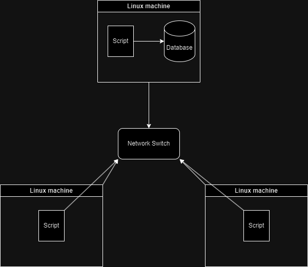

# Linux Cluster Monitoring Agent

# Introduction
The Linux Cluster Monitoring Agent is a tool aimed at system administrators and developers for monitoring hardware usage and specifications across Linux servers. It employs bash scripting for data collection, Docker for database containerization, and PostgreSQL for data storage. The agent gathers and stores metrics such as CPU and memory usage, disk I/O, and hardware specs, facilitating analysis for performance optimization and ensuring the smooth operation of the cluster.

# Quick Start
```
# Set executable permissions to all the scripts
chmod +x ./psql_docker.sh
chmod +x ./host_usage.sh
chmod +x ./host_info.sh

#Start a Postgres instance using Docker
./psql_docker.sh

# Use SQL CLI to create the tables if they aren't created
psql -h localhost -U postgres -d host_agent -f sql/ddl.sql

# goto scripts directory
bash> cd path_to_project/scripts

# Insert hardware specs data into the DB using host_info.sh
bash> ./host_info.sh

# Insert hardware usage data into the DB using host_usage.sh
bash> ./host_usage.sh

# Set up crontab for continuous monitoring 
bash> crontab -e

#Set to monitor every minute
* * * * * bash path_to_project/scripts/host_usage.sh localhost port host_agent postgres password > /tmp/host_usage.log
```

# Implementation
Implemented the project by creating a Docker container for the PostgreSQL database and multiple bash scripts to handle gathering system data and storing system data in the database. Used crontab to automate system data collection. 

## Architecture


## Scripts
```
- psql_docker.sh: Starts a PostgreSQL instance using Docker.
- host_info.sh: Collects hardware information from each node and inserts it into the database. This script is run once at installation time.

- host_usage.sh: Collects real-time hardware usage data (CPU and memory) and inserts it into the database. 
- crontab: used to schedule host_usage.sh to run at regular intervals.
```

## Database Modelling
| host_info        |           |
|------------------|-----------|
| id               | SERIAL    |
| hostname         | VARCHAR   |
| cpu_number       | INT2      |
| cpu_architecture | VARCHAR   |
| cpu_model        | VARCHAR   |
| cpu_mhz          | FLOAT8    |
| l2_cache         | INT4      |
| "timestamp"      | TIMESTAMP |
| total_mem        | INT4      |

| host_usage      |           |
|-----------------|-----------|
| "timestamp"     | TIMESTAMP |
| host_id         | SERIAL    |
| memory_free     | INT4      |
| cpu_idle        | INT2      |
| cpu_kernel      | INT2      |
| disk_io         | INT4      |
| disk_available  | INT4      |


# Test
- All scripts were run using ```bash -x script_name.sh``` to insure all data was correct when testing script functions, validating all script functions and variables. 
- All SQL queries were tested in isolation outside of script usage, verifying correct creation of tables and retrieval of data input/retrieval.

# Deployment
The project was deployed by running a local PostgreSQL container using docker and setting up regular execution intervals of the host_usage.sh script using crontab.

# Improvements
- Combine host-info.sh and host_usage.sh into one script whose functionality is based on its arguments
- Host the PostgreSQL container on the cloud to real cluster functionality, as right now only the system running the container can access it.
- Set up automatic start up of interval execution in the case the system reboots. 
